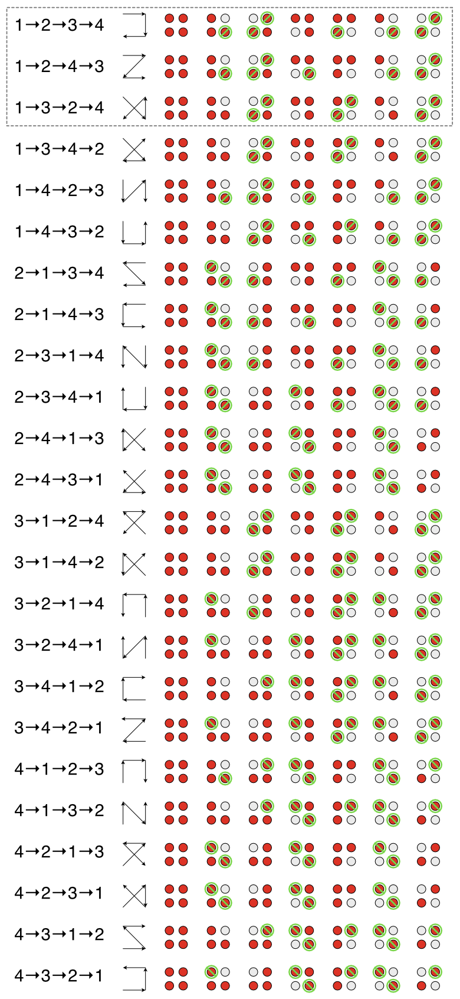

# A note on the minimum number of tests required for sample pooling to detect COVID-19 infection

**Author:** Robert Jacobson \<RobertJacobson@acm.org\> **Acknowledgements:** Thanks to Andy Rhyne for fruitfull discussions and valuable feedback. All errors are my own.

## Abstract

A variety of authors have investigated the benefits of sample pooling to test populations for COVID-19 infection. Of primary interest is reducing the consumption of testing resources, which are a scarce resource during the COVID-19 pandemic, and the accuracy and efficiency of estimating the number of infected individuals. This note discusses the limitations imposed by mathematics on the reduction in number of tests needed to be performed using this testing method and bounds on the number of infected individuals in terms of the number of infected pools. Other limitations related to testing supplies (consumption of pipets, conical tubes, etc.), equipment availability, protocol complexity, and so forth are not discussed. The test for infection is assumed to be 100% effective and 100% sensitive. 

## Sample pooling versus naive sample testing

In naive sample testing, individuals in a population are tested for infection by taking a sample from every individual and testing each sample in isolation. In a population of $N$ individuals, naive sample testing requires $N$ tests.

In (one-dimensional) sample pooling, samples from multiple individuals are combined into a single pool, and the pool is tested once. A negative result indicates that no individual in the pool is infected. We call such a pool a *negative pool*. A positive result indicates that at least one individual in the pool is infected. We call such a pool a *positive pool*. In the event of a positive result, the individuals in the pool must be retested individually to determine which individuals in the pool are infected. Variations on this method are considered.

The word sample is used in a biological sense, referring to a fluid or tissue sample from an individual that will be tested for infection. Both sample pooling and naive sample testing use samples from every individual in the population. These testing methods should not be confused with random sampling, which only takes samples from a subset of the population.

## One-dimensional sample pooling

In one-dimensional sample pooling, the population of $N$ individuals is divided into $g:=N/n$ groups of size $n$. The figure below illustrates a typical qPCR well plate using one-dimensional sample pooling with $N=96$ and $n=8$, giving $g=12$. Let $i$ be the number of infected individuals in the population, denoted by red circles. In this example, $i=3$. The right margin and row background color indicate the outcome of combining the individuals in the pool (by row) and testing the pool. In this example, three pools test positive, because each of the three pools includes an infected individual.

**Fig 1: One-dimensional sample pooling.**

One test is used per pool. In this example, it takes 12 tests to test all 12 pools. Each individual in the positive pools are tested in isolation to identify which individuals are infected. The total number of tests performed is $12 + 3\times 8 = 36$ tests, compared to 96 tests using naive sample testing.

 Observe that naive sample testing is equivalent to the degenerate sample pooling cases of $n=N$ ($g=1$) and $n=1$ ($g=N$). We therefore require that $1<n<N$ (equivalently that $1<g<N$).

### Bounds on the number of required tests for one-dimensional sample pooling

In general, the number of tests required by one-dimensional sample pooling is $T = g + kn$, where $k$ is the number of distinct pools containing infected individuals. The largest $k$ can be is min$(i, g)$. Thus,  $T_{\text{max}}=g + \text{min}(i,g)n$. When $i\leq g$, then $T_{\text{max}}=g + in$. Likewise, the smallest $k$ can be is $0$, corresponding to no infections, so  $T_{\text{min}}=g$. If $i\ll g$ and the individuals are distributed at random, then $k=i$ with high probability. In particular, 

​		Pr$$\displaystyle (k=i)=\frac{g-1}{g}\cdot \frac{g-2}{g}\cdot \;\cdots\; \cdot \frac{g-i+1}{g} = \frac{g!}{g^{i}(g-i)!}$$.

**Fig 2: The probability that no two infected individuals share a pool increases as the number of pools increases relative to the number of infected individuals. In this graph the number of infected individuals is fixed at $i=5$.**

The real distribution of people infected with COVID-19 is not random, and Pr$(k=i)$ should not be assumed to follow this formula.

## $d$-dimensional sample pooling

One-dimensional sample pooling can be improved by simultaneously pooling the columns as well as the rows. We expand on the previous example as follows.

**Fig 3: Two-dimensional sample pooling.**

An infected individual can only exist at the intersection of a positive row pool and a positive column pool. However, not every intersection of a positive row pool and a positive column pool need be an infected individual. For example, using row-major notation, we see an infected individual at position $(10, 3)$ but not at position $(10, 2)$. The benefit is that fewer individuals need to be retested as compared to one-dimensional sample pooling. In this example, two-dimensional sample pooling requires $12+8+3^2 = 29$ tests, the maximum possible number required with this method.

This method can be generalized to $d$-dimensions by indexing each sample with the set $\{1, 2, 3, \ldots, g_1\}\times \{1, 2, 3, \ldots, g_2\}\times \{1, 2, 3, \ldots, g_3\}\times \cdots \times \{1, 2, 3, \ldots, g_d\}$, for positive integers $g_j$ with $1<g_j<N$ and  $\prod_{j=1}^d g_j = g_1\cdot g_2\cdot g_3 \cdot \; \cdots \; \cdot g_d = N$. The sample pools are the $(d-1)$-dimensional hyperplanes formed by fixing the value in one coordinate and allowing the other coordinates to vary. The individuals requiring retesting are those corresponding to the set of points at the intersection of exactly $d$ positive sample pools (hyperplanes). 

**Fig. 4: A three-dimensional representation of the previous examples. There are 18 points at the intersection of three positive pools but only 3 infected individuals.**

### A minor refinement

Instead of testing pools along different dimensions in parallel, testing along dimensions in sequence and removing every negative pool as it is discovered reduces the size of pools along dimensions not yet tested. This does not reduce the number of tests required, as any negative individual will not lie at the intersection of $d$ pools and hence will not be in the set of individuals needing to be retested. However, smaller pool sizes are preferable under more realistic assumptions on the test and when the conservation of other resources are considered.

## Bounds on the number of required tests for $n$-dimensional sample pooling

The number of tests required by $d$-dimensional sample pooling is  $T = g_1+g_2+g_3+\cdots + g_d + k_1\cdot k_2 \cdot k_3 \cdot \; \cdots \; \cdot k_d $ $= \sum_{j=1}^d g_j + \prod_{j=1}^d k_j$, where $k_j$ is the number of distinct positive pools with constant $j^{\text{th}}$ coordinate for each value of $j$. The series represents the total number of pools along all dimensions, all of which must be tested when $i>0$, and is a constant chosen during testing protocol design. The second term represents the number of retests that are required to identify which individuals are infected. Clearly the second term is maximized when either no two positive points lie in the same pool or, if there are too many infected individuals for that to happen, when every pool is positive. Thus, the maximum value of $k_j$ is min$(i, g_j)$, and $T_{\text{max}}=\sum_{j=1}^d g_j + \prod_{j=1}^d \text{min}(i, g_j)$. Observe that if $i<g_j$ for all $j$, then $T_{\text{max}}=\sum_{j=1}^d g_j + i^d$. If every individual is infected, then $T_{\text{max}}=\sum_{j=1}^d g_j + \prod_{j=1}^d g_j = \sum_{j=1}^d g_j + N > N$. Sample pooling is therefore worse than naive sample testing when the number of infected individuals is close to $N$. On the other hand, there are no infected individuals if and only if there are no positive pools along any single dimension. If dimensions are tested in order from smallest to largest, the absence of infected individuals is detectable after only $\text{min}_j \;g_j$ tests. Thus, sample pooling gives the greatest benefit when the number of infected individuals is small.

## Reducing the number of tests further

Consider the example of two-dimensional sample pooling illustrated below. The red circles represent infected individuals. After testing the pools, represented by the squares and triangles, every pool shown is positive.

**Fig. 5: The pools, represented by the squares and triangles, are all positive, whereas there are only two infected individuals.**

The retest set is the set of circles lying at the intersection of a positive row and positive column, which is every circle. The minimum number of infected individuals needed to have both row pools be positive is two, one for each row. Similarly, there must be at least two infected individuals to have two column pools be positive. Without retesting, we cannot determine whether any particular individual is infected. The naive approach is to test them all, which requires four tests. Suppose, however, that we happen to test Circle 2 first, resulting in a negative outcome, and then Circle 3, giving another negative outcome. We would then know two particular circles of the four are negative and that there must be at least two positive circles. We conclude, therefore, that the remaining two circles must be positive without having to test them. 

**Fig. 6: The catalog of all orderings of retesting a retest set of four points with points that logically can be left untested annotated. Observe that all orderings can be obtained from the first three by compositions of reflections and rotations. All orderings allow for either six or seven tests to be elided.**

The rule for eliding tests in two dimensions can be stated as follows: When a point tests negative, every point adjacent to that point (excluding diagonals) must be positive and thus need not be tested.

TODO: Extend to $n$-dimensions. (The “next” dimension is a “retest” of the previous sample pooled tests but with pools instead of individuals….)

**Fig. 7: Negative points in a three-dimensional retest set.**

TODO: Improvement on bounds of number of required tests.

## Bounds on the number of infected individuals

The number of infected individuals can be estimated by stopping the testing protocol after testing pools in the first $d$-dimensions, eliding the retest phase. 

## Probabilistic expectation of the number of required tests

TODO.

​	—Include “cutoff points” of when scheme is no longer advantageous. Should have its own section?

## Summary

We assume the test for infection is perfect, i.e. that the test is 100% effective and 100% sensitive. The table below gives the definition of the variables used.

### Variables used

| Variable         | Meaning                                                      | Formula                                                      | How It’s Determined                                 |
| ---------------- | ------------------------------------------------------------ | ------------------------------------------------------------ | --------------------------------------------------- |
| $N$              | Number of individuals in the population being tested         |                                                              | Chosen                                              |
| $n$              | Number of pools  (one-dimensional pooling).                  |                                                              | Chosen                                              |
| $g$              | Size of each pool (one-dimensional pooling)                  | $g:=N/n$                                                     | Derived from chosen values of $N$ and $n$           |
| $d$              | Number of dimensions                                         |                                                              | Chosen                                              |
| $g_j$            | Size of each pool along dimension $j$, that is, in which the $j^\text{th}$ coordinate is constant. Each $g_j$ is an integer factor of $N$. | $N=\prod_{j=1}^d g_j$                                        | Chosen                                              |
| $k$              | Number of positive pools (one-dimensional pooling)           |                                                              | Empirically                                         |
| $k_j$            | Number of positive pools among the total number of pools $g_j$ along dimension $j$ |                                                              | Empirically                                         |
| $i$              | Number of infected individuals within the population         |                                                              | Empirically                                         |
| $T$              | Number of tests required for the given application of the testing protocol | $T= \sum_{j=1}^d g_j + \prod_{j=1}^d k_j$                    | Chosen                                              |
| $T_{\text{max}}$ | Maximum number of tests that can be required for the given testing protocol | $T_{\text{max}}=\begin{cases} \sum_{j=1}^d g_j + i^d& i<g_j \forall j \\ \sum_{j=1}^d g_j + N & i=N\\ \sum_{j=1}^d g_j + \prod_{j=1}^d \text{min}(i, g_j) & \text{generally}  \end{cases}$ | Derived from test design and empirical value of $i$ |
| $T_{\text{min}}$ | Minimum number of tests that can be required for the given testing protocol | $T_{\text{min}}=\text{min}_j \;(g_j)$                        | Derived from chosen values of $N$ and $n$           |
|                  |                                                              |                                                              |                                                     |

### Theorems

1. The total number of tests required for $d$-dimensional pooling is $T_{\text{max}}=\sum_{j=1}^d g_j + \prod_{j=1}^d \text{min}(i, g_j)$$=\begin{cases} \sum_{j=1}^d g_j + i^d& \text{if }i<g_j\; \forall j \\ \sum_{j=1}^d g_j + N & \text{if }i=N  \end{cases}$.
2. As a consequence of (1), pooled sample testing is of greatest benefit when the number of infected individuals is small (close to 0).
3. As a consequence of (1), pooled sample testing requires more tests than naive sample testing if the number of infected individuals is large (close to $N$).
4. Dimensions must be tested in order from smallest to largest to detect the absence of infected individuals after $\text{min}_j \;g_j$ tests, which is optimal.
5. The number of tests used on pools is the total number of pools, which is $\sum_{j=1}^d g_j$.
6. The number of retests of individuals required is $\prod_{j=1}^d \text{min}(i, g_j) = \begin{cases} i^d& \text{if }i<g_j\;\forall j \\ N & \text{if }i=N \end{cases}$.

