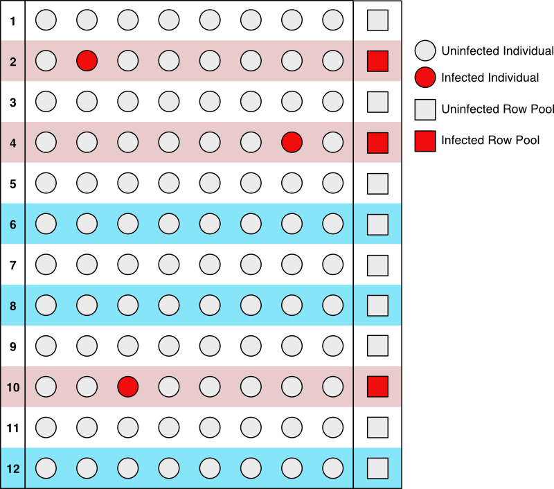

# Research Assignment: Conjectures on Sample Pool Testing for COVID-19

**Author:** Robert Jacobson \<RobertJacobson@acm.org\> This research assignment is based on "A note on the minimum number of tests required for sample pooling to detect COVID-19 infection," in preparation.

## Introduction

A variety of authors have investigated the benefits of sample pooling to test populations for COVID-19 infection. Of primary interest is reducing the consumption of testing resources, which are a scarce resource during the COVID-19 pandemic, and the accuracy and efficiency of estimating the number of infected individuals. This research assignment is to investigate the limitations imposed by mathematics on the reduction in number of tests needed to be performed using this testing method and bounds on the number of infected individuals in terms of the number of infected pools. Other limitations related to testing supplies (consumption of pipets, conical tubes, etc.), equipment availability, protocol complexity, and so forth are not discussed. The test for infection is assumed to be 100% effective and 100% sensitive. 

## Sample pooling versus naive sample testing

In naive sample testing, individuals in a population are tested for infection by taking a sample from every individual and testing each sample in isolation. 

In (one-dimensional) sample pooling, samples from multiple individuals are combined into a single pool, and the pool is tested once. A negative result indicates that no individual in the pool is infected. We call such a pool a *negative pool*. A positive result indicates that at least one individual in the pool is infected. We call such a pool a *positive pool*. In the event of a positive result, the individuals in the pool must be retested individually to determine which individuals in the pool are infected. Later we will also investigate variations on this method.

The word *sample* is used in a biological sense, referring to a fluid or tissue sample from an individual that will be tested for infection. Both sample pooling and naive sample testing use samples from every individual in the population. These testing methods should not be confused with random sampling, which only takes samples from a subset of the population.

#### Question

**Easy.**

1. How many tests are required to determine which individuals are infected in a population of size $N$ using naive sample testing?

## One-dimensional sample pooling

In one-dimensional sample pooling, the population of $N$ individuals is divided into $g:=N/n$ groups of size $n$. The figure below illustrates a typical qPCR well plate using one-dimensional sample pooling. Let $i$ be the number of infected individuals in the population, denoted by red circles. The right margin and row background color indicate the outcome of combining the individuals in the pool (by row) and testing the pool. 

**Fig 1: One-dimensional sample pooling.**

#### Questions

**Easy.**

1. Determine the values of $N$, $n$, $g$, and $i$ for this example.
2. How many tests are required to test the pools?
3. How many pools are positive?
4. How many tests are required in total to completely determine which individuals are infected?
5. Explain why naive sample testing is equivalent to the two “degenerate” sample pooling cases of $n=1$ and $n=N$.

**Medium.**

Let $T$ be the number of tests required for a given sample pooled test, and let $k$ be the number of distinct positive pools (pools containing infected individuals).

1. Give a formula for $T$ in terms of $g$, $k$, and $n$.
2. What is the largest that $k$ can be?
3. Use your answers to (1) and (2) to find a formula for $T_{\text{max}}$, the largest possible value for $T$. (Do not assume $i<=g$.)
4. Redo (3) using the assumption that $i\leq g$.
5. Give a formula for $T_{\text{min}}$, the smallest possible value for $T$.

**Interesting.**

1. Dr. Jacobson claims that when $k=i$ with high probability when we have $i\ll g$ ($i$ much smaller than $g$) and assume the samples have been randomly arranged. Find an explicit formula for $\text{Pr}(k=i)$, the probability that $k=i$, under the assumption that $i\leq g$.
2. Fix $i=5$. Using your answer for (1), make a plot of $\text{Pr}(k=i)$ for values of $g$ ranging from 5 to 500. 
   Technical Hints: Feel free to use a step size of 5 for the values of $g$. The graph will be a sequence of points, not a continuous curve. For Excell, use a scatterplot. For Mathematica, use [DiscretePlot](https://reference.wolfram.com/language/ref/DiscretePlot.html). For Python with Matplotlib, use [this code](https://jakevdp.github.io/PythonDataScienceHandbook/04.02-simple-scatter-plots.html). For Python with seaborn, use [this code](https://python-graph-gallery.com/40-basic-scatterplot-seaborn/).
3. Why should scientists *not* assume Dr. Jacobson’s claim holds in real life? That is, what is different about real life that should keep us from assuming our formula for $\text{Pr}(k=i)$ holds even if we are already fairly certain we know the probability of infection?

## Two-dimensional sample pooling

One-dimensional sample pooling can be improved by simultaneously pooling the columns as well as the rows. We expand on the previous example as follows.

**Fig 2: Two-dimensional sample pooling.**

An infected individual can only exist at the intersection of a positive row pool and a positive column pool. 

#### Questions

**Easy.**

1. Does every intersection of a positive row and positive column contain an infected individual?
2. For this example, how many tests are required in total to completely determine which individuals are infected? Compare your answer to the answer for the one-dimensional case.

**Medium.**

We repeat the questions from the one-dimensional example but with two-dimensional pooling. Again, let $T$ be the number of tests required for a given sample pooled test, let $g_1$ and $g_2$ be the number of pools in the rows dimension and the columns dimension respectively, and let $k_1$ and $k_2$ be the number of distinct positive pools (pools containing infected individuals) corresponding to the rows dimension and columns dimension respectively.

1. Give a formula for $T$ in terms of $g_j$ and $k_{j}$.
2. What is the largest that $k_j$ can be?
3. Use your answers to (1) and (2) to find a formula for $T_{\text{max}}$, the largest possible value for $T$. (Do not assume $i<=g_j$ for all $j$.)
4. Redo (3) using the assumption that $i<=g_j$ for all $j$.
5. Give a formula for $T_{\text{min}}$, the smallest possible value for $T$.

## $d$-dimensional sample pooling

This method can be generalized to $d$-dimensions by indexing each sample with the set $\{1, 2, 3, \ldots, g_1\}\times \{1, 2, 3, \ldots, g_2\}\times \{1, 2, 3, \ldots, g_3\}\times \cdots \times \{1, 2, 3, \ldots, g_d\}$, for positive integers $g_j$ with $1<g_j<N$ and  $\prod_{j=1}^d g_j = g_1\cdot g_2\cdot g_3 \cdot \; \cdots \; \cdot g_d = N$. The sample pools are the $(d-1)$-dimensional hyperplanes formed by fixing the value in one coordinate and allowing the other coordinates to vary. The individuals requiring retesting are those corresponding to the set of points at the intersection of exactly $d$ positive sample pools (hyperplanes). 

**Fig. 3: A three-dimensional representation of the previous examples. There are 18 points at the intersection of three positive pools but only 3 infected individuals.**

### A minor refinement

Instead of testing pools along different dimensions in parallel, testing along dimensions in sequence and removing every negative pool as it is discovered reduces the size of pools along dimensions not yet tested. This does not reduce the number of tests required, as any negative individual will not lie at the intersection of $d$ pools and hence will not be in the set of individuals needing to be retested. However, smaller pool sizes are preferable under more realistic assumptions on the test and when the conservation of other resources are considered.

#### Questions

**Medium.**

Do every “Medium” question from the previous section.

**Interesting.**

1. Explain how to arrange the testing to further reduce the number of tests required for the special case of no infected individuals.

## Reducing the number of tests further

Consider the example of two-dimensional sample pooling illustrated below. The red circles represent infected individuals. After testing the pools, represented by the squares and triangles, every pool shown is positive.

**Fig. 4: The pools, represented by the squares and triangles, are all positive, whereas there are only two infected individuals.**

The retest set is the set of circles lying at the intersection of a positive row and positive column, which is every circle. The minimum number of infected individuals needed to have both row pools be positive is two, one for each row. Similarly, there must be at least two infected individuals to have two column pools be positive. Without retesting, we cannot determine whether any particular individual is infected. The naive approach is to test them all, which requires four tests.

#### Questions

**Easy.**

1. Find an order in which the samples 1 through 4 can be tested such that, given all pools are positive, one test can be logically deduced and therefore skipped.
2. Find an order that allows two tests to be skipped.

**Interesting.**

1. In the figure below, every possible ordering of the samples 1 through 4 are given, followed by a graphical representation of this ordering corresponding to Fig. 4, followed by a list of all possible ways the population can result in all positive pools. For at least the first three orderings (boxed by dotted lines), annotate the samples of each population that can be skipped using the given ordering.

   

2. How can the skippable tests for the remaining orderings be computed from the first three without computing them directly? (You don’t have to actually compute them—but it will definitely help you internalize what’s going on!)